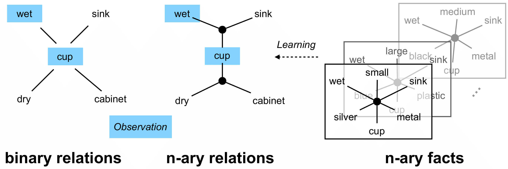

# LINK
Code and data for our RSS 2021 paper "Learning Instance-Level N-Ary Knowledge for Robots Operating in Everyday Environments"



## Data
The raw data can be downloaded [here](https://www.dropbox.com/s/iopu2sfevitpe2w/LINK_dataset.zip?dl=0). Unzip the data
to `/data`. 

Two python dictionaries `object_data` and `object_instance_data` are stored in the pickle file `/data/LINK_dataset/object_data.pkl`. We discuss
the structure and content of each dictionary below. 

### Object Instances
Object instances are stored in `object_data` dictionary. Each entry in the dictionary represents an object instance, specifically
an Amazon product. Each object instance has the following attributes:
```shell
- id [int]: an unique identifier assigned to this object 
- class [str]: the class of the object (e.g., cup, mug)
- name [str]: name of the Amazon product (e.g., zova Bathroom Tumbler 340ml, 3 pieces)
- price [float]: Amazon price 
- weight [float]: weight
- size [list of float]: x, y, z dimension
- material [str]: material (e.g., plastic)
- color [str]: color (e.g., white)
- transparency [str]: transparency (e.g., opaque)
- dimension [list of str]: words describing its dimension (e.g., thick and short)
- physical_property [list of str]: physical properties (e.g., fragile and hard)
- shape [list of str]: words describing its shape (e.g., holow and curved)
```

### Situated Object Instances
Sitauted object instances are stored in `object_instance_data` dictionary. Each entry in the dictionary represents an object
situated in a specific environmental context (e.g., a half-full coffee mug on a kitchen table). Each situated object instance 
has the following attributes describing its state:
```shell
- id [int]: points back to the object class
- iid [int]: an unique identifier assigned to this object instance
- room [str]: where this object instance is found (e.g., kitchen)
- state_description [str]: raw phrases and sentences from mturk workers describing the state of the object instance
- specific_place [str]: the more specific location of this object instance (e.g., on table)
- cleaniness [str]: cleaniness (e.g., dirty)
- dampness [str]: wetness (e.g., wet)
- fullness [str]: whether the object is full, specifically for containers (e.g., empty)
- temperature [str]: temperature of the object (e.g., cold)
```

## Visualize Data
To analyze the correlations between any two object properties (e.g., dampness and purity), use the following script
```shell
python plot_heatmap.py --property_1 dampness --property_2 purity
```

## Convert Data To Role-Value Format
`object_data` and `object_instance_data` can be combined and converted to the role-value format. In that format, each
unique object is expressed as a list of role-value pairs, where each role is a property type and each value is the
corresponding property. Here is one example:
```python
[('class', 'bottle'), ('color', 'blue'), ('color', 'clear'), ('dampness', 'dry'), ('dimension', 'long'), ('dimension', 'narrow'), ('material', 'plastic'), ('purity', 'normal'), ('room', 'dining_room'), ('shape', 'irregular'), ('spatial_distribution', 'full'), ('temperature', 'room_temperature'), ('transparency', 'transparent')]
``` 

To complete the conversion, first modify the config file `configs/data/data_non_repeating_10_value_negative_expanded.yaml` (e.g., change paths) and then run the following script:
```shell
python main/build_role_value_data.py
```

- `non_repeating` means that the created data split will have no test leakage. 
- `10_value_negative` means 10 negative examples are sampled by randomly perturbing one value at a time for each positive example in the training set. 
- `expanded` means literal property types (i.e., price, weight, and size) are discretized and included in the data.


## Experiments
Our transformer model and the baseline models can be evaluated on missing value prediction (i.e., predicting one missing value given all other role-value pairs of an instance).

- Transformer (Ours)

    To run the model, modify the config file `configs/transformer/run_transformer_non_repeating_10_value_negative_expanded.yaml` and run the following script:
    ```shell
        python run_Transformer.py
    ```
    
- NaLP
 
    To run the model, modify the config file `configs/nalp/run_nalp_non_repeating_10_value_negative_expanded.yaml` and run the following script:
    ```shell
        python run_NaLP.py
    ```
    
- Frequency model

    To run the model, modify the config file `configs/frequency/run_frequency_non_repeating_10_value_negative_expanded.yaml` and run the following script:
    ```shell
        python run_frequency_model.py
    ```

- Random

    To run the model, modify the config file `configs/random/run_random_non_repeating_10_value_negative_expanded.yaml` and run the following script:
    ```shell
        python run_random_model.py
    ```
